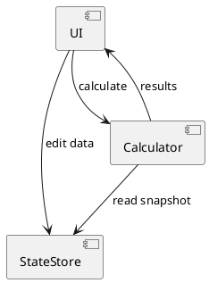

# SPEC-1-Weekend Expense Balancer

## Background

When small groups of friends travel together, expenses are often paid unevenly across multiple events such as transportation, meals, or activities. While the *expected* cost is usually split equally, the *actual* payment is often made by one or two individuals. Manually reconciling who owes whom after the trip is error‑prone, time‑consuming, and mentally taxing.

The goal of this project is to create a **frontend‑only, responsive web application** that makes it extremely easy to:
- Capture who *actually paid* and who *was supposed to pay* at each event
- Automatically compute per‑event imbalances
- Aggregate those imbalances into a final settlement
- Produce clear instructions on who should send money to whom

The application prioritizes **speed, clarity, and minimal user input**, optimized for real‑world scenarios where users enter data casually on their phones during or after a trip.

---

## Requirements

### Must Have (M)
- User can define a **fixed list of participants** for a trip
- User can **add, edit, and remove events** dynamically
- Each event tracks, per participant:
  - Actual amount paid
  - Expected amount to pay
- Expected amounts can be **auto‑initialized as equal split** among included participants
- Actual amounts default to **0 for all participants**
- Support **single‑payer scenarios** with minimal input
- App calculates:
  - Per‑event balance per person (actual − expected)
  - Net balance per person across all events
- App generates **explicit settlement instructions** (who sends how much to whom)
- Fully **client‑side only** (no backend, no authentication)
- Responsive UI usable on mobile and desktop

### Should Have (S)
- Ability to **exclude a participant from a specific event** (expected = 0)
- Inline recalculation as values are edited (no submit button required)
- Clear visual distinction between:
  - Owed money (positive balance)
  - Money owed (negative balance)
- Ability to rename events and participants

### Could Have (C)
- Preset shortcuts (e.g., "Split equally", "One person paid")
- Summary view per event before final settlement
- Local persistence using browser storage (refresh‑safe)

### Won’t Have (W)
- User accounts or login
- Cloud sync or multi‑device collaboration
- Currency conversion
- Expense categories or analytics beyond settlement


## Method

### Overall Approach

The application is implemented as a **pure client-side state machine** with an explicit *edit → calculate → review* flow.

Key principle:
- **No calculations occur while editing**
- All math is executed only when the user presses a single **Calculate** button

This keeps data entry fast, predictable, and free of distracting UI changes.

---

### UI Flow

1. **Setup Screen**
   - User defines the fixed list of participants
   - Names only; no amounts yet

2. **Event Entry Screen** (repeatable)
   - Each event is a collapsible card
   - For each participant:
     - Input: *Expected amount* (set to 0 if excluded)
     - Input: *Actual paid amount*
   - Shortcuts per event:
     - **Split Expected Equally** → fills expected amounts for included participants
     - **Single Payer** → sets all actual = 0 except selected payer

3. **Calculate Action**
   - A single, prominent **Calculate** button
   - Locks editing temporarily
   - Runs balance and settlement algorithms

4. **Results Screen**
   - Net balance per participant
   - Explicit settlement instructions (who sends how much to whom)

---

### Data Model (Frontend State)

```json
{
  "participants": [
    { "id": "p1", "name": "Alice" },
    { "id": "p2", "name": "Bob" }
  ],
  "events": [
    {
      "id": "e1",
      "name": "Lunch",
      "entries": {
        "p1": { "expected": 15, "actual": 30 },
        "p2": { "expected": 15, "actual": 0 }
      },
        "p2": { "included": true, "expected": 15, "actual": 0 }
      }
    }
  ]
}
```

All calculations derive from this immutable snapshot taken at **Calculate time**.

---

### Balance Calculation Algorithm

For each event:
```
balance(person, event) = actual_paid − expected_paid
```

For each person across all events:
```
net_balance(person) = Σ balance(person, event)
```

Interpretation:
- Positive → person is owed money
- Negative → person owes money

---

### Settlement Algorithm

1. Split participants into two lists:
   - **Creditors**: net_balance > 0
   - **Debtors**: net_balance < 0

2. Sort both lists (optional, descending by absolute value)

3. Greedy matching:
   - Take first debtor and first creditor
   - Transfer:
     ```
     amount = min(|debtor.balance|, creditor.balance)
     ```
   - Reduce both balances
   - Continue until all balances reach zero

This guarantees:
- Minimal number of transactions
- Exact settlement (no rounding drift assuming consistent currency)

---

### Component Architecture (Conceptual)



---

### Comparable Existing Applications

- **Splitwise**: similar settlement logic but far heavier (accounts, syncing, history)
- **Settle Up**: closer UX, still recalculates continuously

This design intentionally simplifies:
- No auth
- No background recalculation
- One-shot calculation model

---

### Key Design Guarantees
- Deterministic results (same input → same output)
- Zero backend dependencies
- Easily portable to any frontend stack (React, Vue, Svelte, plain JS)


## Implementation

### Technology Stack

The MVP is implemented as a **static frontend application** with no backend dependencies.

Recommended stack (chosen for simplicity and contractor familiarity):
- **React (v18+)** with TypeScript
- **Vite** for build tooling
- **CSS Flexbox / Grid** (no heavy UI framework required)
- **LocalStorage** for persistence

Alternative stacks (equally valid):
- Vue 3 + Composition API
- Svelte
- Plain JavaScript + Web Components

The design is framework-agnostic as long as the state model and calculation flow are preserved.

---

### Application Structure

```
src/
 ├─ components/
 │   ├─ ParticipantSetup.tsx
 │   ├─ EventCard.tsx
 │   ├─ ShortcutBar.tsx
 │   ├─ CalculateButton.tsx
 │   └─ ResultsView.tsx
 ├─ state/
 │   ├─ useAppState.ts
 │   └─ types.ts
 ├─ logic/
 │   ├─ calculateBalances.ts
 │   └─ settleDebts.ts
 ├─ App.tsx
 └─ main.tsx
```

Clear separation:
- **components** → UI only
- **logic** → pure functions (testable)
- **state** → single source of truth

---

### State Management

A single global state object:

```ts
interface AppState {
  participants: { id: string; name: string }[];
  events: {
    id: string;
    name: string;
    entries: Record<string, { expected: number; actual: number }>;
  }[];
  results?: CalculationResult;
}
```

Rules:
- State is freely editable **until Calculate is pressed**
- On Calculate:
  - Take a deep copy snapshot
  - Pass snapshot to calculation logic
  - Store results separately

---

### Calculation Trigger

Implementation detail:
- `CalculateButton` calls `runCalculation()`
- UI is temporarily read-only during calculation (optional but recommended)

```ts
function runCalculation(state: AppState): CalculationResult {
  const balances = calculateBalances(state);
  const settlements = settleDebts(balances);
  return { balances, settlements };
}
```

No debouncing, no auto-effects — **explicit only**.

---

### Balance Calculation Implementation

```ts
function calculateBalances(state: AppState): Record<string, number> {
  const totals: Record<string, number> = {};

  for (const p of state.participants) totals[p.id] = 0;

  for (const event of state.events) {
    for (const pid in event.entries) {
      const { expected, actual } = event.entries[pid];
      totals[pid] += actual - expected;
    }
  }

  return totals;
}
```

---

### Settlement Algorithm Implementation

```ts
function settleDebts(balances: Record<string, number>) {
  const creditors = [];
  const debtors = [];

  for (const [pid, amount] of Object.entries(balances)) {
    if (amount > 0) creditors.push({ pid, amount });
    if (amount < 0) debtors.push({ pid, amount: -amount });
  }

  const settlements = [];

  let i = 0, j = 0;
  while (i < debtors.length && j < creditors.length) {
    const d = debtors[i];
    const c = creditors[j];
    const transfer = Math.min(d.amount, c.amount);

    settlements.push({ from: d.pid, to: c.pid, amount: transfer });

    d.amount -= transfer;
    c.amount -= transfer;

    if (d.amount === 0) i++;
    if (c.amount === 0) j++;
  }

  return settlements;
}
```

---

### Persistence Strategy

- Serialize `AppState` (excluding results) to **localStorage** on every edit
- Restore on page load
- Results are recalculated only via Calculate button

This guarantees:
- Refresh-safe data entry
- No accidental recalculation

---

### UI/UX Details

- Numeric inputs default to `0`
- Equal split shortcut:
  - Computes total expected / participant count
  - Rounds to 2 decimals (configurable)
- Clear color semantics:
  - Green → owed money
  - Red → owes money

---

### Implementation Constraints

- No floating-point surprises: use consistent rounding strategy
- No hidden mutations during editing
- No implicit calculations

This MVP can be implemented by a small contractor team in **1–2 weeks** and deployed as a static site (Netlify, GitHub Pages, S3).
